<!----- Conversion time: 10.396 seconds.


Using this Markdown file:

1. Cut and paste this output into your source file.
2. See the notes and action items below regarding this conversion run.
3. Check the rendered output (headings, lists, code blocks, tables) for proper
formatting and use a linkchecker before you publish this page.

Conversion notes:

* Docs to Markdown version 1.0β14
* Wed Jan 23 2019 13:44:46 GMT-0800 (PST)
* Source doc: https://docs.google.com/open?id=1dOtlPTJogH2NrjlyYFUYCDYXiyKc0iB9FT3hiYriOuw

----->


## NMEA Bridge Design and Use


## Introduction

The Horizon GX2200 radio is also an AIS receiver, and has a built-in GPS. It has an AIS display, but it's low-resolution. Fortunately, it also has the ability to send NMEA-compliant messages out along some wires that come out the back of the radio. When the radio is properly configured, but GPS and AIS messages come out of the same pair of wires (grey and brown) at 38400 baud.

The "bridge" device described here transfers these messages from their "wired" form to wireless, but wrapping each message in a UDP packet (a transmission protocol designed to carry short messages, any one of which is not essential and can be lost). UDP is generally reliable, and because both the GPS and AIS messages are sent multiple times in quick succession, the possibility of occasional packet-loss was not a concern for me.

UDP packets can be sent across a Wifi network, and typically have a destination address, indicating the computer to which they are to be set, and a "port" on that computer as well --- this is a little like having a street address and an apartment number. The packets sent by the bridge unit are "broadcast" packets, which means that they are sent to _all_ addresses on the network, but they still have a "port" number as well -- in this case 10110, which is an informal standard for NMEA packets.

What that means is that any computer on the network can "listen" for these packets and decode them. In particular, my tablet, on which I run OpenCPN, can be set up to listen for this packets and use them to move the chart to my current location (via the GPS data in the packets), and to display the nearby traffic that's indicated by the AIS data that's in other packets.


## System setup

The setup for my electronics is relatively simple, and is shown here:


```
[GX2200]------[BRIDGE] …… [Wireless Router] …... [TABLET]

Dashes are wired connections; dots are wireless.
```


The wireless router is a basic old Netgear router; it's run in the most basic mode, with a simple password for authentication. Normally a wireless router would have a connected to a cable-modem or some other thing that connected it to a wide-area network, but I don't have those on my boat. So this router is merely a way to connect various wireless devices on my boat to each other. I've set up this entire system at home as well, using my home's wireless router instead of the boat's; it provided a good way to test the system, and it worked fine (although I had to place the GX2200 antenna near a window so that it could get a GPS fix and pick up the AIS messages). My home computer, a Mac, also connected to the Wireless router, and by running the "terminal" program, installing a tool called "socat", and then typing


```
socat -u udp-recv:10110 -
```


\
(the trailing hyphen is important!), I was able to see all the NMEA packets printed out on my screen.

An alternative setup is to use a "switch" rather than a wireless router, and do everything with ethernet cables, rather than wirelessly. The bridge unit described here is of _no use_ for that approach.

As it happens, I'll also be attaching my radar unit to the wireless router (via ethernet cable --- it's really a "wired plus wireless" router), and the data from the radar will also be broadcast to the tablet, but that's a whole different story.


## Wiring the bridge unit

The bridge has 3 pairs of connectors.

The first is for +12V and ground, i.e., the first supplies power to the unit. There's no on/off switch, and if you want one, you should install it in the 12V line that powers the unit.

The second pair is for the NMEA inputs. The particular NMEA handling piece of hardware that I used seems to want the two inputs attached "wrong". The NMEA standard has a notion of A and B connections, sometimes called + and -, or A+ and B- (as on my RS485 unit). As shown on page 19 of the GX2200 manual, the Gray wire is NMEA +, and the Brown wire is NMEA -. It appears that my RS485 units may be mislabelled, as the system works with Brown connected to A+, gray to B-.

The third pair of connectors serves two purposes. First, if you place a normally-open pushbutton across the two terminals, you can reset the bridge unit by pressing it at the right moment during startup. (See the "Operations" section for details.) Second, they can be attached to a serial port on a computer, and when you do so, a terminal program that connects with this port will receive various status messages during operation. This is primarily a tool for debugging, and not expected to be used in ordinary installations. Only if you understand both the circuitry of the bridge and the programming should you find anything of interest here.

So a fancy wiring setup looks like the following figure:


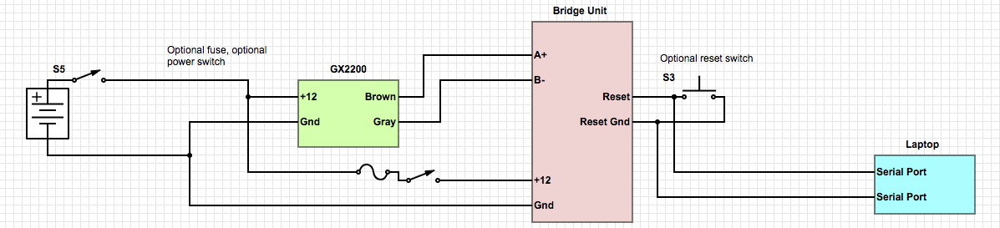


The switch at the far left is the vessel's breaker or power switch for the radio.

The fuse and power switch just to the left of the bridge unit are optional, and all the wiring to the right of the bridge unit is optional. So a simpler (and more typical) installation looks like this:


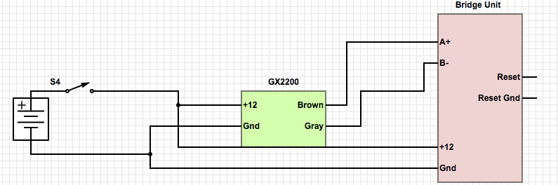


A single vessel breaker or power switch turns on both the radio and the bridge unit; there's no reset button on the unit, nor any laptop for monitoring its work. Don't do either hookup yet --- read on until you reach the Installation and Initial Configuration section.


## Operation

Generally, when power is applied to the bridge unit, the green and red LEDs flash, the unit tries to connect to its last known WiFi network, and then it begins turning NMEA sentences into UDP packets and sending them out. This sequence of events can be altered by either a press of the "reset" button during the correct period, or by a problem with the WiFi network, or by there being no last known WiFi network (typically during the first startup). We'll go through the details of this startup process in a moment.

After startup, the bridge receives NMEA sentences from the GX2200 and tries to translate them into UDP packets. If (i) a sentence is too long (more than 128 characters) or (ii) a start-character (either a $ or a ! character) is followed by another start-character before an end-character (\n), or (iii) there are miscellaneous characters before the first start-character, or (iv) there are miscellaneous characters between an end-character and the next start-character, then the bridge unit ignores that data, but also signals an error by flashing the red LED for one second. In typical operation, you should never see the red LED after the first few second of operation. (When the unit is first listening to data from the GX2200, it may start listening mid-sentence, causing a a type-iii error, for instance.) If there's lots of electrical noise in the environment, it's possible that there may be substantial errors in the data the bridge receives, and the red LED may often flash. If this happens, you should not trust the bridge to do its job!

Let's return to the typical startup sequence. It looks like this:

3 green flashes, each ¼-second long.

A five-second period during which "reset" is allowed [typically the reset button is NOT pressed]

An attempt to connect to the last known network [typically this succeeds]

A half-second green flash, indicating successful connection to the WiFi network

The red and green LEDs come on together, letting you check that both are working

The green turns off, then on for about 3 seconds, and then off

Shortly thereafter, the red turns off.

Following this, in normal operation, each time a sentence is sent out as a UDP packet, there is a _very_ brief flash of the green LED.


## Installation and initial configuration

Before installing the bridge at all, let's set up the radio to produce the right kind of data. Turn on your radio, and (following the instructions on page 94 of the manual, repeated here) set up the radio to output 38400 baud:


1.  Press and hold the Call/Menu key until Setup Menu appears
1.  Rotate the CH know to select "GENERAL SETUP" menu
1.  Press the SELECT soft key, then rotate the CH knob to select NMEA DATA IN/OUT.
1.  Press the SELECT soft key
1.  Rotate the CH knob to select the desired baud rate (38400 baud for us!)
1.  Press the ENT soft key to store the new setting
1.  Press the QUIT soft key two times to return to radio operation.

Then also follow the steps on page 125 of the manual to select which sentences the GX2200 sends out. I personally selected the GGA and RMC sentences. By default, all NMEA sentences are turned off, and you'll only get AIS sentences, so if you want to use the GX2200 as the GPS that drives your OpenCPN system as I did, you'll want to follow these steps.


1.  Press and hold the CALL/MENU key until Setup Menu appears
1.  Rotate the CH know to select GPS SETUP menu
1.  Press the SELECT soft key, then select NMEA OUTPUT with the CH knob
1.  Press the SELECT soft key.
1.  Rotate the CH knob to select the desired sentence type (e.g., "GGA"), and then press the ENT soft key.
1.  Rotate the CH knob to select ON or OFF (I recommend "ON")
1.  Press the ENT soft key to save the new setting
1.  Repeat steps 5 through 7 to set the other sentences.
1.  Press the QUITE soft key twice to return to radio operation.

**Now **install and wire the bridge as shown above. At the same time, install and configure a wireless router. Let's suppose that the wireless network has SSID (i.e., network name) _MyBoatNet_, and password _Popeye. _

Here's what a **first-time startup** will typically involve:


1.  With your smartphone or laptop, confirm that you can connect to the wireless network. Unless you have the router connected to a cable modem or some other connection to the internet, you should not expect to be able to load any web pages, etc., but you should be able to _connect_ using the SSID and password above.
1.  Turn on power to the bridge unit. Assuming that its last known network is not "visible" from the boat, you should see the green LED flash 3  quarter-second flashes, and no more.
1.  After a few seconds, use your smartphone or laptop to select a new wireless network. You should see a network called "NMEA Bridge AP". Go ahead and select that network. Your phone should attempt to connect, and be immediately brought to a web page saying "NMEA Bridge AP", with a button saying "Configure WiFi", and looking something like this:
1.  Press the Configure Wifi button, and from the list of networks that appear, select _MyBoatNet_ (or whatever your network was named), and then type the password into the space provided. Finally, click on "Save" (which may be hidden by your smartphone's keyboard, which you'll have to dismiss).
1.  In a few moments, the remainder of the startup sequence should follow: A half-second green flash, indicating successful connection to the WiFi network; the red and green LEDs come on together, letting you check that both are working; the green turns off, then on for about 3 seconds, and then off; shortly thereafter, the red turns off.

You can now turn on your radio, and after a few moments, you should see the green LED give an occasional flash, as NMEA data is sent to the router and then broadcast to the rest of the wireless network. Here's a sequence of phone screenshots, with annotations, to show the process.

First I go to Settings and pick Wifi, and see the list of available networks. See the one saying "NMEA Bridge AP"? I click on that:


##

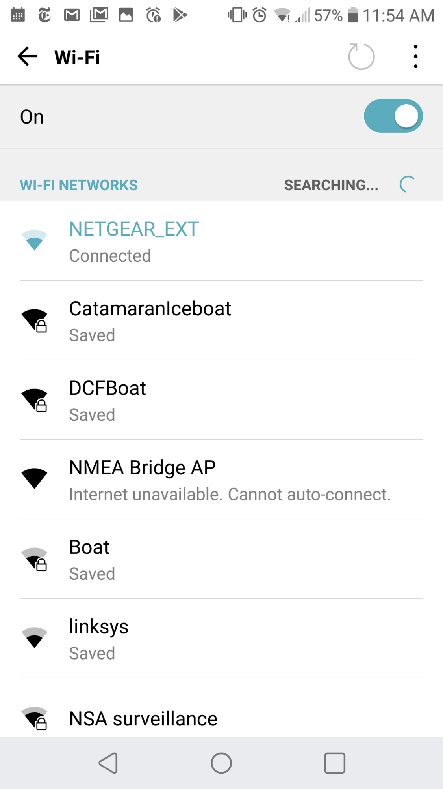


Up comes a dialog where I click on "Connect"


##


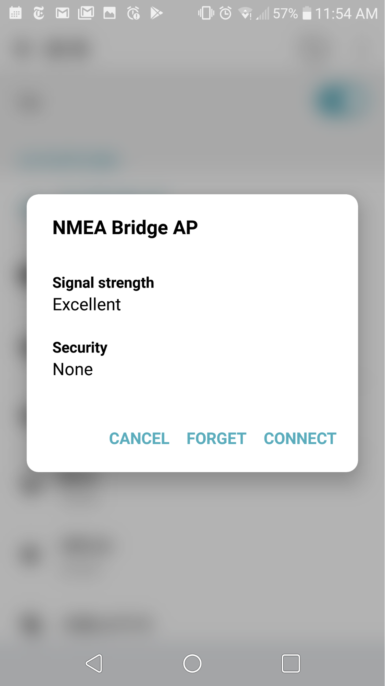


And then the interface from the Bridge shows up:


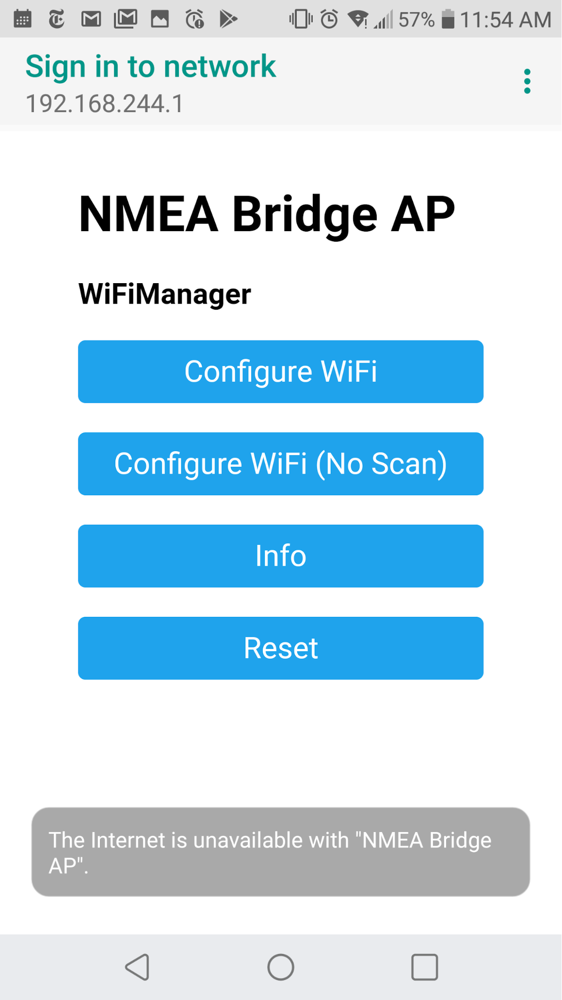


And I click "Configure WiFi". Ignore the warning that "The internet is unavailable…". The next screen is this:


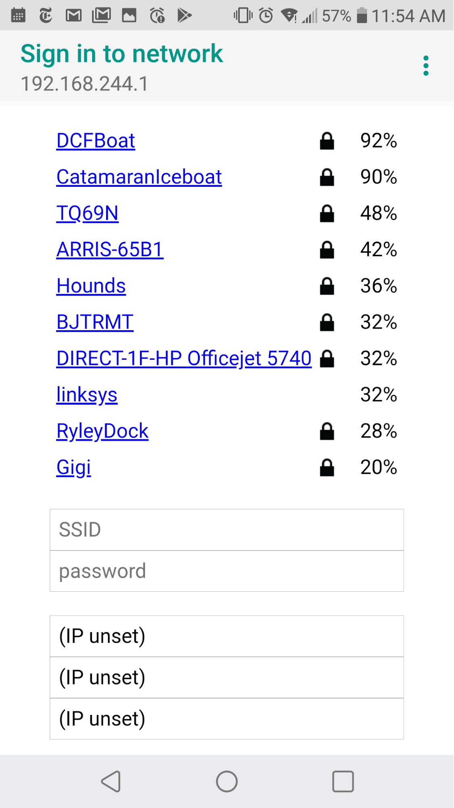


which shows all the various wireless networks in my area. I select the one called DCFBoat (because that's the one I'm using for testing) and click on it.


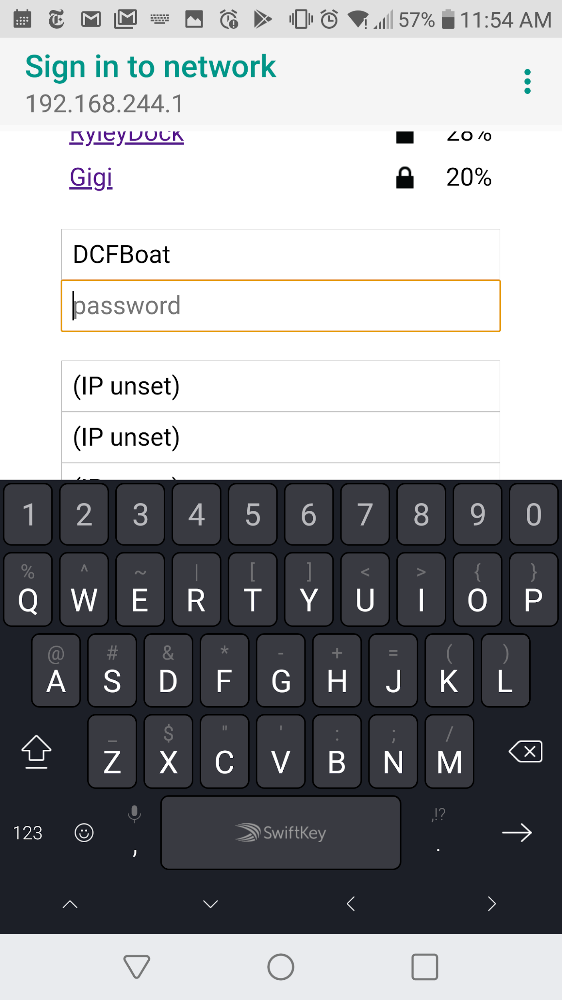


and the system responds by asking me for the password, which I enter:


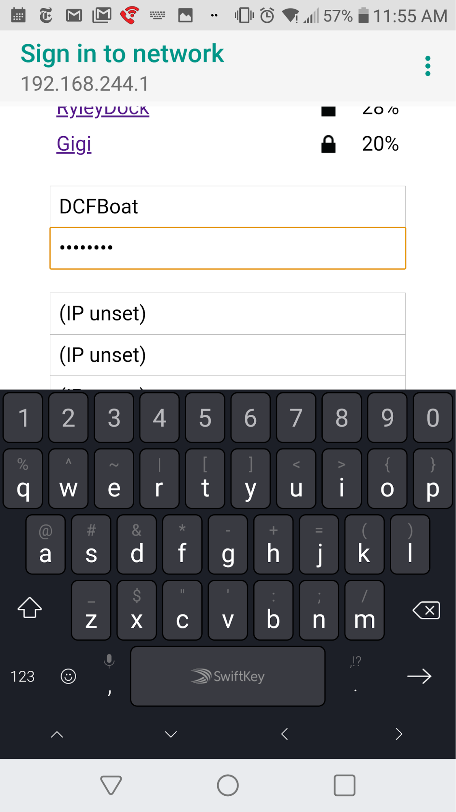
\
To proceed, I need to hide the keyboard, so I click on the downward-pointing triangle in the lower left to reveal the rest of the page:


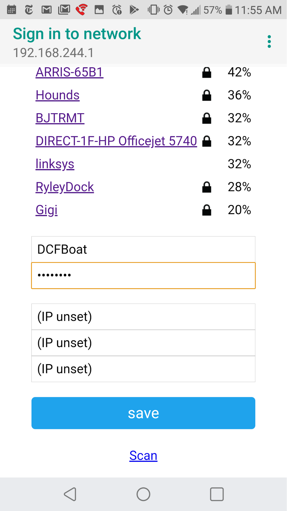


and then click on "save". The result is the following:


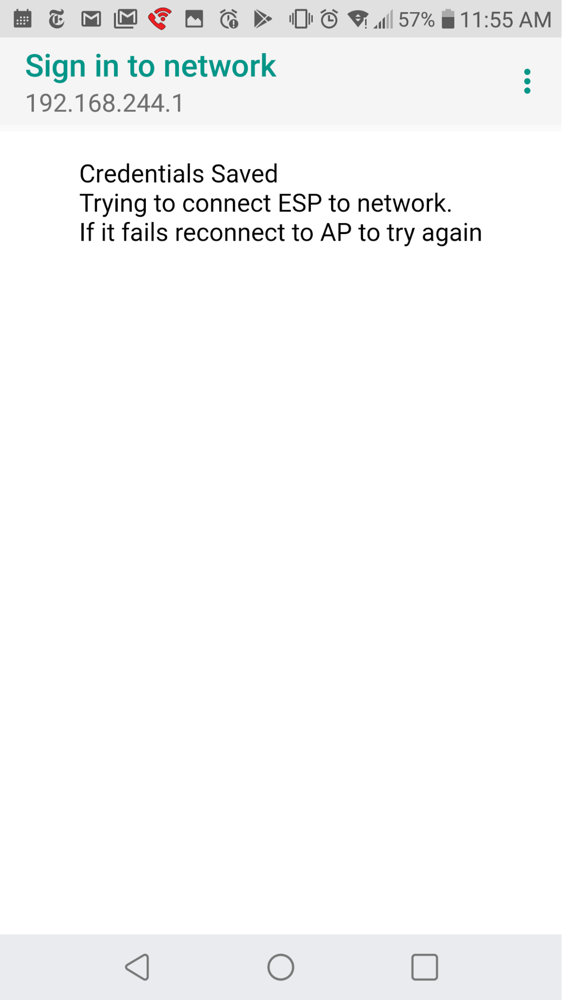


which is shortly replaced by this:


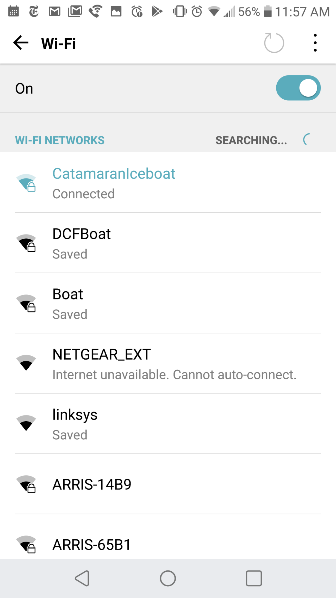


where you can see that the bridge access point is no longer an available network, and we're done and things are ready to go.


## Typical use _after_ initial configuration

After the initial configuration, the bridge unit should work without any intervention on your part, _as long as you turn on your WiFi Router before the bridge unit_. If the bridge unit is turned on before the router, it may try to connect and fail, at which point it will set up the NMEA Bridge AP

network as above, allowing you to reconfigure if you so desire. Typically, you won't want to do this, and the solution is to turn off the bridge unit, turn on the router, and then turn on the bridge unit. It will reconnect to the router's network and work normally. Until the radio is also turned on, the bridge unit will simply go through its initial blinking-lights phase and then sit idle, with no lights blinking at all.

On the other hand, if the bridge is unable to connect to a Wifi network at all, despite repeated attempts, it'll continue to operate (in the sense of running its main loop, where OTA programming might happen, at least initially), but with the red alarm light on continuously.


## Testing that the bridge is doing its job

I have at least two ways to test that the bridge is functioning properly. One is to use OpenCPN, the navigation package that got me started on building this thing in the first place. The other is to use a Linux-like tool on either my Mac or my Galaxy Tablet. I'll address the second one first, because it's the simplest.

On the Galaxy, I installed "Termux", which is a Linux-like terminal program, which includes a program called socat. On my mac, I installed (using brew or macports) the "socat" program. In either one, I can connect the device to the same network that the bridge is using. in the pictorial example above, that's DCFBoat; in the text example, it would be MyBoatNet. I then open a terminal, and type


```
socat -u udp-recv:10110 -
```


and if everything is working, I get a sequence of NMEA sentences appearing, one per line, on my screen.

For OpenCPN, I open the program, and in the collection of large icons I see, I click on the one that looks like a wrench (4th from the left in this picture)


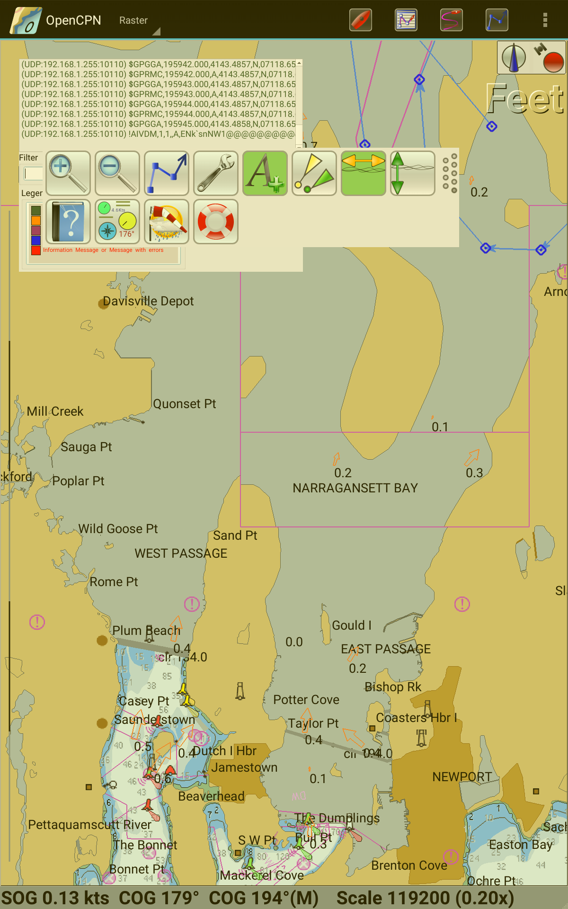


and then select the "connections" tab. That shows me this (as of January, 2019; with constant updates to OpenCPN, I anticipate that in the future things may not appear exactly the same):


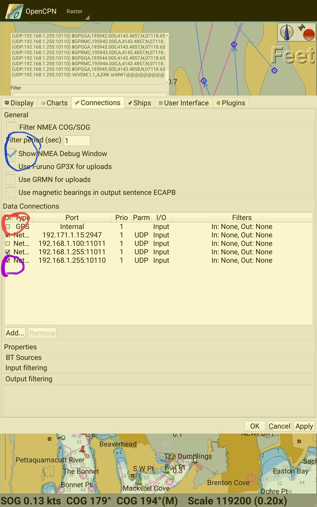


On that page, I (see blue circle) click on the "Show NMEA Debug Window", which causes the little panel shown above the settings dialog to appear, where I see things like "UDP 192.168.1.255:10110): $GPGGA,..." appearing --- those are the NMEA sentences. I also (red circle) choose _not_ to use the GPS that's built into my tablet, because it's less reliable than the one in the GX2200. Finally (purple circle) I add a data connection saying that on network 192.168.1.255, port 10110, I except to get data via UDP packets. (You'll see that just above this, I've said to listen on port 11011 --- that's left over from previous trials, and I should remove it.) Once I click "apply" I will not only see the arriving data scrolling by in the little NMEA debugging window, but if the AIS display (the 6th one from the right, with the yellow and green triangles) is active rather than greyed out, and there are AIS-equipped vessels in my neighborhood, I should see them indicated as large yellow or green triangles on the display.

Once everything is working, you can turn off the NMEA Debug window so that it stops obscuring part of your chart.


## Technical details

Here is the circuit diagram for the device I built. It uses the ESP-01 chip, a few resistors and capacitors, one diode, and two LEDs. It also uses a power supply module that converts from 9-24V down to 3.3V, providing power for the ESP-01, and an RS485 receive/transmit module that works with a 3.3V supply. (Many require 5V). I was able to fit all these onto a small breadboard, along with three pairs of screw-connectors. The Fritzing file included with this project shows the layout I used, although if your power supply or RS485 module are shaped differently, you'll need to fiddle a bit to make things fit. The two capacitors are mis-labelled as "mfd" rather than "ufd", which is what they should be. No values in the circuit are exact: if you want brighter LEDs, go ahead and use 150 ohm resistors instead of 1K. The 47 ufd electrolytic can be 100 ufd or even 220 ufd. The diode can be a 1N4003 or 1N4007, although the leads in that case may be too bulky to fit through the holes on the perfboard.


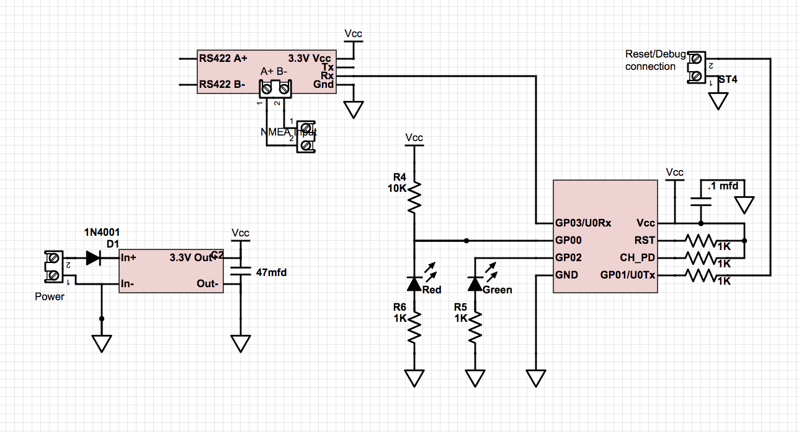


Here are a few notes about the circuit.


1.  The perfboard on which I constructed the circuit was this one: [https://www.amazon.com/gp/product/B00PX52C7Q/](https://www.amazon.com/gp/product/B00PX52C7Q/), called an "SB4 Snappable PC breadboard"; I used exactly half the board to build the circuit. The overall circuit size is about 2.5 x 2.5 inches, meaning that it'd probably fit nicely in a box like this: [https://www.amazon.com/uxcell-100mmx68mmx40mm-Universal-Enclosure-Transparent/dp/B0714N28YT/](https://www.amazon.com/uxcell-100mmx68mmx40mm-Universal-Enclosure-Transparent/dp/B0714N28YT/). On the other hand, if you're willing to put a small "window" in a box like this -- [https://www.lowes.com/pd/CARLON-1-Gang-Gray-PVC-Weatherproof-Exterior-New-Work-Old-Work-Standard-Rectangular-Electrical-Box/3127589](https://www.lowes.com/pd/CARLON-1-Gang-Gray-PVC-Weatherproof-Exterior-New-Work-Old-Work-Standard-Rectangular-Electrical-Box/3127589) -- you can get it at your local Lowe's store.
1.  The diode is there to prevent against reverse polarity on the power supply lines; a better design would also include a ½-amp slo-blo fuse.
1.  The bridge may draw as much as 500mA during startup, and it may do so suddenly. Handling that surge is the function of the 47 ufd electrolytic capacitor between Vcc and Gnd.
1.  The ESP-01 is sensitive to noise, and the manufacturer suggests a .1 ufd capacitor between Vcc and Gnd, mounted as close to the ESP-01 as possible.
1.  The GP00 pin is used during startup to determine the state of the chip (regular operation vs preparing to be flashed with a new program, etc.), and the 10k resistor tying that pin to Vcc is to ensure proper startup.
1.  GP01 is set to be an input during the first five seconds after power-up, and if it's tied to ground during that period, it causes the program to set up the configuration access point. After those initial five seconds, it's set to be an output, and Serial.print output is sent to it, at 38,400 baud, allowing you to debug the unit if you so choose.
1.  There's one last thing: the ESP-01 can be reprogrammed using "over the air" programming during the first 10 seconds after startup. So if you want to make a new and improved version of the program, you can do so without removing the ESP-01 module from its socket.

Here are photos of two versions of the circuit that I built; one has a larger power supply that sticks off the end of the perfboard, and its inputs and outputs are oriented differently, requiring a little rewiring. Neither has the small noise-suppressing capacitor installed, because I didn't have any in my parts box. The one with the smaller power supply  (on the right) lacks the 47 ufd capacitor because I didn't have one handy when I built it. The LEDs are also crammed closer together than in the second version, and the Fritzing drawing was adjusted to make more room for them. I also moved the RS485 module closer to the edge of the board to provide more room for the electrolytic cap (which is 220 ufd in this case, rather than the specified 47 ufd). The small grey wire just to the right of the red and black power wires was used for testing the "reset" function. The red power wire came out from its screw terminal when I moved the unit for this picture.


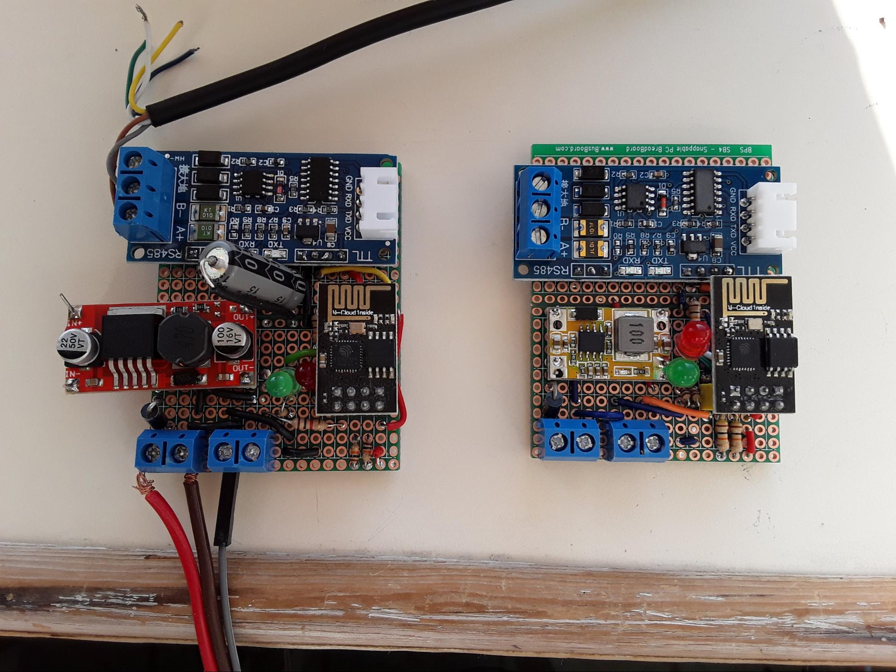


Physical construction

To find a converter from NMEA (which uses the RS485 standard) to a 3.3V signal, I did the following search:

[https://www.ebay.com/sch/i.html?_from=R40&_trksid=m570.l1313&_nkw=RS485+3.3v+converter&_sacat=0](https://www.ebay.com/sch/i.html?_from=R40&_trksid=m570.l1313&_nkw=RS485+3.3v+converter&_sacat=0)

And found a device that looked like this:


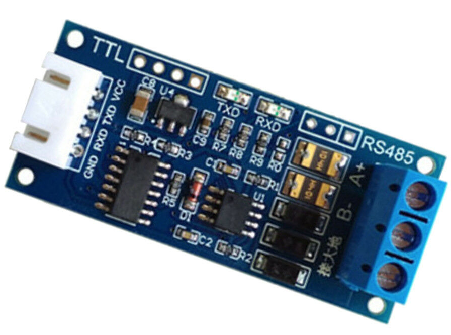


I then soldered some header pins into the four holes next to the "TTL" lettering, and more into the three holes near the RS485 lettering (these latter headers were there only for physical support -- I connected the RS485 wires to the screw terminals). An easy alternative would have been to leave this module separate, and simply plug in the 4-wire harness at the white connector opposite the screw terminals, and run three of those wires to appropriate spots on the breadboard. These modules cost about $3 from China.

Then I searched for "12V 3.3V power supply" and found something that looked like this:

I soldered header pins into the four corners (with a little deflection, because the spacing isn't exactly on 0.1inch centers). One of these burned out quickly when I shorted the output --- my fault entirely -- and I ended up using a different supply. My main goal was finding a supply that could tolerate input voltages to 18V, because sometimes battery charging can run voltages up as high as 15.6V, and I didn't want to burn out the power supply in that situation. I could probably have used a zener diode, etc., but getting a more rugged supply seemed to work fine. These supplies seem to cost around $5-$7.


## The software

As with all Arduino-like programs, there's a setup and a main loop. In this program, the setup is somewhat complicated; the main loop is comparatively simple. The "setup" part prepares the ESP-01 for over-the-air (OTA) programming, establishes the Wifi connection, uses the LEDs to provide some initial status feedback (and test the LEDs) and initializes a few global variables; I'll give more detail below.

The broad idea of the main loop is that periodically a sentence arrives and is stored in the receive buffer of the ESP-01 (which is 1024 bytes, enough for about eight sentences). The main loop reads whatever is in that buffer, placing it into a local copy called "espBuffer" (although it does this copying only when there are at least 20 characters present, so as to not constantly be calling the relatively expensive read() procedure), and if new characters were read, it also processes them, sending out a UDP packet if a full NMEA sentence is found. The main loop does one more thing: it checks to see if the alarm (red) LED has been on for at least a second, and if so, shuts it off. This allows alarms to be obvious to the user without blocking all other processing for a whole second.

There are four parts of the software:

i. Handling the red and green LEDs to communicate information to the user,

ii. Setting up the WiFi connection to the local WiFi router,

Iii. Handling over-the-air programming, and

iii. receiving and processing and transmitting the NMEA data, which is the largest part.


#### LED handling

The green LED (STATUS_LED_PIN 2) is used to report the status via various flashing patterns. The "beep(p, q)" procedure turns on the LED for p milliseconds, followed by q milliseconds of turning the LED off. In both cases, we use the "delay" procedure, which can yield to other processes like the WiFi-handling processes on the chip, but even so, during normal operation we avoid long "beep"s because it's possible for the input buffer to fill up during this time. The red LED (ALARM_LED_PIN 0) is turned on with the flashAlarm() procedure, which first briefly pulls the pin low so that the LED turns off, and then pulls the pin high to light the LED, and records the time at which the alarm was turned on in a global variable alarmStart, and sets the boolean  alarmOn to true. Each time through the main loop, we call alarmCheck(), which checks whether alarmOn is true; if so, it checks whether a second has elapsed since the lamp was turned on. If it has elapsed, we turn the lamp off, and set alarmOn to false.  The check for the one-second elapsed time has an intrinsic error: if the time when the alarm starts is neary the largest possible integer value, then it may be turned off in less than a second (as soon as the millis() function wraps around). This happens only after the unit has been on for at least 49 days, and hence is unlikely to be a problem.


### Setting up Wifi communications with the wireless router

The WiFi handling is almost all handled by the WiFiManager software. That software, after the first time it's run, stores wifi credentials (the current network SSID and password) in EEPROM on the ESP-01, so that it's readable and reusable the next time the system is turned on. If there are no stored credentials, of if those credentials fail to work, the wifi manager establishes an access point (AP) which you can connect to from your smartphone, computer, etc.; connecting to it is described in the Installation and Initial Configuration section above. Let's look at the part of the setup() procedure that deals with this. The global boolean wifiFlag, which indicates whether a connection to the WiFi router has been established,  is initialized to false. The green LED is flashed three times, and then pin 1 (the Serial output pin) is changed to be a digital input pin. Then for five seconds, if this pin is connected to ground, three things happen: i. The green ED flashes rapidly five times in a row, ii. Wifi management begins by setting up the access point (even before trying to connect using saved credentials), and iii. if this succeeds, wifiFlag is set to true.  On the other hand, if the pin is never grounded, or if the AP setup doesn't work properly, and five seconds have passed, then wifiFlag remains false, but pin 1 is changed to be a digital output pin (so that we can use Serial.print() for debugging.)

At this point, if wifiFlag is still false, we call setupWifi() (as many as ten times), which via wifiManager.autoConnect() attempts to connect using the stored credentials (if any) or uses the AP setup method described earlier.  If it fails all these attempts, then wifiFlag remains false, and the main loop, observing this, sets the red alarm LED on during each pass through the loop, so that it remains on continuously.

After the setupWifi() attempts, if there's been success, we take the local IP address (the IP address of the bridge unit on the wireless router's network) and change the last byte to 255, and record this as the broadcast IP address, in a global variable, and then flash the green LED for two full seconds to indicate the end of the setup process.


### OTA programming

The global variable otaFlag is true when over-the-air programming is allowed, and false otherwise. It's initialized to true. During the setup() procedure, we call otaSetup(), which prepares the chip to be able to be re-programmed over the wireless network. (Basically, if the arduino IDE sends the right signal to the chip, it goes into OTA mode and downloads a new program via wireless, and then begins running that program.) Doing this preparation consists of establishing a password (so that random folks can't update your software without your permission), and then building a few callback procedures that let you view the status/progress of OTA programing if you happen to have a terminal connected to the Serial output from the chip. The setPassword() call establishes "bridge" as the password; the onStart() sets the "type" of the OTA process to be either "sketch" or "spiffs" (ours will always be "sketch"). onEnd() and onProgress() establish callback procedures to show (via Serial) that we're either partway through the upload process, or done with it. And onError() sets up a callback to announce certain classes of errors. When these are all established, otaBegin() starts the OTA process (i.e., makes sure that if an OTA message comes in over wireless, we can respond to it).

Within the main loop, Arduino.otaHandle() checks, each time through the loop, whether an OTA message has been received. When OTA_INTERVAL seconds (currently 30 sec) have passed since startup, we set otaFlag to false, so that OTA handling is disabled thereafter.

NB: If the wifi setup procedure fails, then we never make it into the main loop, and OTA programming will never take place, because otaHandle() will never get called.


### Processing NMEA sentences

This is the heart of the program. The starting point is the content of the espBuffer, which may, at any given moment, be empty, contain the start of a sentence but not its end, contain the end of one sentence, possibly followed by the start of another, or perhaps even several more, or contain some "noise", followed by any (or none) of the previous items. Letting "S" denote a start character (either $ or !) and E denote the sentence-ending character "\n", and x denote other characters, and # denote noise, here are several possible buffer contents


1.  <empty>
1.  xxxESxxx…
1.  ##Sxx...xxESxxx
1.  Sxxx
1.  Sxxx … xxxE
1.  Sxxx … xxxE##
1.  ##SxxxSxxx...xxxE
1.  Sxxx..##..xxxE
1.  Sxxx…<136 xs> xxE

In example 2, the bridge may have started up at a time when the GX2200 was in the middle of a sentence, so that the bridge only caught the last few characters of the sentence. The characters "xxxE" must be discarded. In example 3, there are a few characters of noise before the start of the first sentence, which is itself followed by another partial sentence. The noise needs to be discarded. In example 4, we have an as-yet-incomplete sentence in the buffer. Example 5 is a complete sentence. Example 6 shows a complete sentence, followed by a few characters that must be noise, as they do not follow a start-character. Example 7 starts with noise, then a partial sentence, which is interrupted by the start of a new sentence; the noise and partial sentence must be discarded. And Example 8 shows a sentence with a few extra noise characters in the middle of it. Unless this makes the sentence more than 128 characters, we send it out as if it were a valid sentence. Example 9 shows a sentence with more than 140 characters in it, which is too long for the NMEA spec, so something must be wrong with the data; we must throw it all away.

Handling of NMEA data is done by dataCheck(), which puts data into (and extracts data from) espBuffer[]. At all times, the data in espBuffer is terminated with a \0, so that we can use strlen() on it, and the number of characters in the espBuffer is stored in bufferCount.

First we check whether there are enough new characters for us to bother reading them; if not, we return from the dataCheck() procedure. If there _are_ enough characters, we check that there's enough room in the buffer for them to fit. If there's not enough room, we signal an error, empty the entire buffer, and return. If there _is_ enough room, we read the characters into the buffer, update the bufferCount, add a \0 at the end, and then repeatedly call consume(), which starts with data like that shown in the nine examples above. The consume() procedure returns true if the buffer is altered, and false otherwise.

The consume() procedure first checks whether the buffer is empty; if so, it returns false. Otherwise, it uses find() to examine the start of the buffer and return one of five possible states:


1.  The buffer doesn't begin with a start-character,
1.  The buffer starts with an S, but that's followed by another S before an E is encountered
1.  The buffer starts with S, which is followed, in fewer than 129 characters, by an E
1.  The buffer starts with S, but there are more than 128 characters after it, none of which are an E
1.  The buffer starts with S, but there are fewer than 127 characters after it, none of which is an E.

In case 1, consume() discards data up to the first S (or the end of the buffer, whichever comes first) and returns true. In case 2, it discards the data from the starting S up to (but not including) the next S, and signals an error. In case 3, it grabs all the data between the S and E and transforms it to a UDP packet and sends it out, and then shifts the buffer to the left to eliminate this just-processed data. In case 4, it discards characters from the initial S up through the next 127 characters, and reports an error. In all these cases, the epsBuffer is modified, so consume() returns true.

In case 5, there's data that could potentially eventually become a complete sentence, but is not one yet. We simply return false.

discardBadBytes(n) looks at the first n characters of the espBuffer (or fewer, if there are not that many), and discards any and all of these up to (but not including) the first Start character ($ or !) that it encounters. If any characters are discarded, an alarm is generated. When this procedure is done, either the buffer is empty, or the first character of the buffer is a start character.


<!-- Docs to Markdown version 1.0β14 -->

